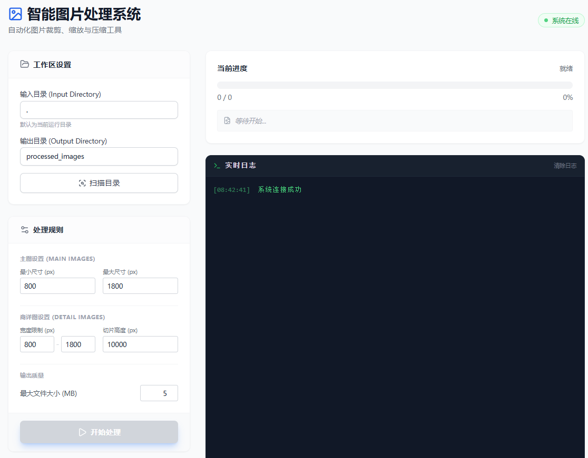

# Smart Image Resizer / 智能电商图片处理工具

[English](#english) | [中文](#chinese)



---

<a name="english"></a>
## English

### Introduction
**Smart Image Resizer** is a lightweight, local web-based tool designed for e-commerce operators and designers. It automates the process of resizing, padding, and slicing product images to meet platform requirements. Built with **FastAPI** (Python) and **Vue.js** (CDN), it offers a clean, modern interface without the need for complex setups.

### Key Features
- **Auto-Scanning**: Automatically detects "Main Images" and "Detail Images" folders in your workspace.
- **Smart Resizing**:
  - **Main Images**: Centers and pads images with a white background, resizing them to a specified range (default 800-1800px).
  - **Detail Images**: Resizes width while maintaining aspect ratio.
- **Auto-Slicing**: Automatically slices long detail images (height > 10000px) into smaller chunks.
- **Compression**: Optimizes images to meet file size limits (default < 5MB).
- **Privacy First**: All processing happens locally on your machine. No images are uploaded to the cloud.

### Requirements
- Python 3.8+
- Modern Web Browser (Chrome, Edge, Firefox, etc.)

### Installation & Usage

1.  **Clone the repository**:
    ```bash
    git clone https://github.com/Danrry1996/smart-image-resizer.git
    cd smart-image-resizer
    ```

2.  **Install dependencies**:
    ```bash
    pip install -r requirements.txt
    ```

3.  **Run the application**:
    ```bash
    python -m uvicorn backend:app --host 0.0.0.0 --port 8000 --reload
    ```

4.  **Open in Browser**:
    Visit [http://localhost:8000](http://localhost:8000) to start using the tool.

---

<a name="chinese"></a>
## 中文

### 简介
**智能电商图片处理工具 (Smart Image Resizer)** 是一款专为电商运营和美工设计的本地化轻量级工具。它可以自动化处理商品图片，包括尺寸调整、白底填充和长图切片，以满足各大电商平台的上传要求。本项目基于 **FastAPI** (Python) 和 **Vue.js** (CDN) 构建，界面简洁现代，无需复杂的安装配置。

### 核心功能
- **自动扫描**: 自动识别工作区内的“主图”和“商详图”文件夹。
- **智能缩放**:
  - **主图**: 自动居中并填充白底，尺寸智能调整至指定范围（默认 800-1800px）。
  - **商详图**: 宽度自适应，保持长宽比。
- **长图切片**: 对于高度超过 10000px 的长图，自动切分为多张小图。
- **智能压缩**: 自动优化图片大小，确保文件小于指定限制（默认 5MB）。
- **隐私安全**: 所有处理均在本地进行，图片不会上传到云端，确保数据安全。

### 环境要求
- Python 3.8+
- 现代网页浏览器 (Chrome, Edge, Firefox 等)

### 安装与使用

1.  **克隆项目**:
    ```bash
    git clone https://github.com/Danrry1996/smart-image-resizer.git
    cd smart-image-resizer
    ```

2.  **安装依赖**:
    ```bash
    pip install -r requirements.txt
    ```

3.  **运行程序**:
    ```bash
    python -m uvicorn backend:app --host 0.0.0.0 --port 8000 --reload
    ```

4.  **开始使用**:
    打开浏览器访问 [http://localhost:8000](http://localhost:8000) 即可使用。

---

## License
MIT License
